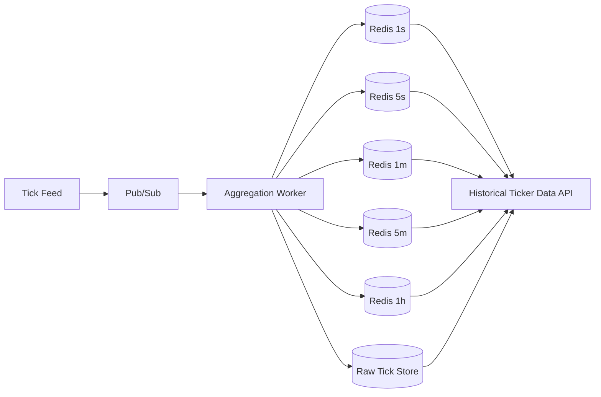

# Multi-Resolution Dataset Calculation from Real-Time Data

## Goal

Generate multiple time resolutions (for example 1s, 5s, 1m, 5m, 1h) from a real-time tick stream so the client can:

1. Use fine-grained data when zoomed in.
2. Use aggregated data when zoomed out.
3. Preserve raw ticks as source of truth.

## Input Model

Each incoming tick should include at minimum:

```json
{
  "symbol": "BTCUSD",
  "timestamp_ms": 1716987330123,
  "price": 68420.3,
  "volume": 0.45,
  "sequence": 9987123
}
```

## Output Model (Candle Rollup)

For each symbol and resolution bucket:

```json
{
  "symbol": "BTCUSD",
  "resolution": "1m",
  "bucket_start_ms": 1716987300000,
  "open": 68410.0,
  "high": 68450.2,
  "low": 68398.1,
  "close": 68420.3,
  "volume": 125.44,
  "tick_count": 1200,
  "first_sequence": 9986000,
  "last_sequence": 9987199
}
```

## Bucket Calculation

For a resolution of $R$ milliseconds:

$$bucket\_start = \left\lfloor\frac{timestamp\_ms}{R}\right\rfloor \times R$$

Examples:

1. 1s -> $R = 1000$
2. 5s -> $R = 5000$
3. 1m -> $R = 60000$
4. 5m -> $R = 300000$
5. 1h -> $R = 3600000$

## Per-Tick Update Rules

When a tick lands in a bucket:

1. If bucket does not exist:
   set open=high=low=close=price, volume=tick.volume, tick_count=1.
2. If bucket exists:
   high=max(high, price), low=min(low, price), close=price.
3. Always increment:
   volume += tick.volume, tick_count += 1.
4. Track sequence range:
   first_sequence=min(first_sequence, sequence), last_sequence=max(last_sequence, sequence).

## Real-Time Aggregation Pipeline



## Practical Processing Strategy

1. Read tick from pub/sub.
2. Write raw tick to immutable store.
3. For each configured resolution, compute bucket_start.
4. Upsert rollup bucket in Redis (or state store).
5. Periodically flush finalized buckets to durable storage.

This is $O(k)$ per tick, where $k$ is number of resolutions.

## Finalization and Late Data

1. Keep a grace window (for example 2-5 seconds) before finalizing a bucket.
2. If a late tick arrives within grace window, reopen/update bucket.
3. If a late tick arrives after finalization:
   apply correction policy (amend bucket + mark corrected, or append correction event).

## Query-Time Resolution Selection

Choose resolution by visible window and pixel width:

$$target\_points \approx chart\_width\_px$$

$$ideal\_bucket\_ms = \frac{window\_ms}{target\_points}$$

Pick the smallest supported resolution >= ideal_bucket_ms.

Example:

1. Window: 24h = 86,400,000 ms
2. Width: 1200 px
3. ideal_bucket_ms = 72,000 ms
4. Choose nearest supported resolution: 1m or 5m depending on density policy.

## Data Integrity Safeguards

1. Enforce sequence monotonicity per symbol.
2. Detect sequence gaps and emit alerts.
3. Store first and last sequence in each bucket for auditability.
4. Rebuild rollups from raw ticks for verification jobs.

## Recovery and Rebuild

If rollup cache is lost or corrupted:

1. Replay raw ticks for required time range.
2. Recompute all bucket levels deterministically.
3. Repopulate Redis and mark rebuild completion timestamp.

## Minimal Pseudocode

```text
onTick(tick):
  appendRaw(tick)
  for each resolution in [1s, 5s, 1m, 5m, 1h]:
    start = floor(tick.ts / resolution) * resolution
    bucket = get(symbol=tick.symbol, res=resolution, start=start)
    if bucket missing:
      init bucket from tick
    else:
      bucket.high = max(bucket.high, tick.price)
      bucket.low = min(bucket.low, tick.price)
      bucket.close = tick.price
      bucket.volume += tick.volume
      bucket.tick_count += 1
      bucket.last_sequence = max(bucket.last_sequence, tick.sequence)
    upsert(bucket)
```

## Recommended Defaults

1. Resolutions: 1s, 5s, 1m, 5m, 1h.
2. Grace window: 3 seconds.
3. Bucket TTL in Redis: aligned to retention tier (for example 30 days for hot data).
4. Background verification: hourly sample-based rollup vs raw reconciliation.
