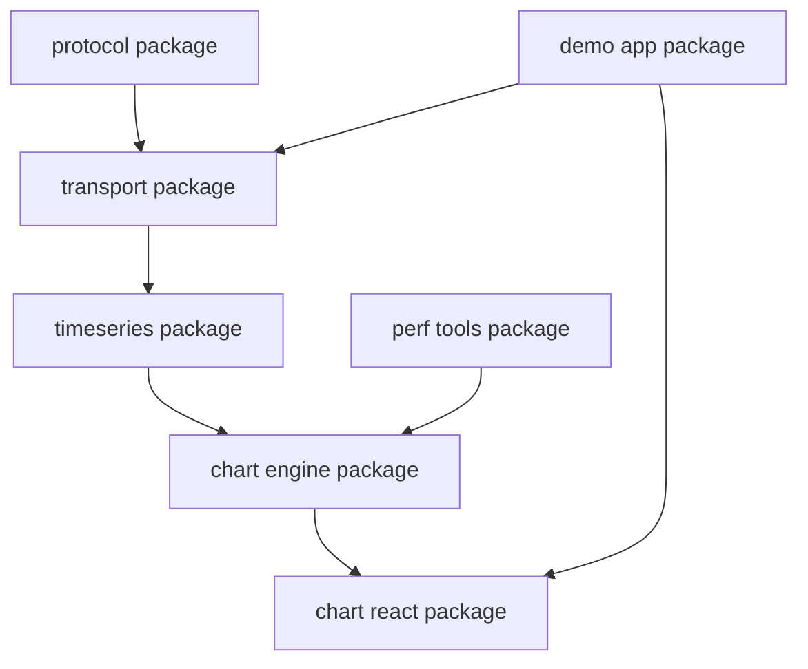

## Package-Oriented Delivery Plan

Break the implementation into modular packages, then integrate in the application shell.

1. @station-alpha/protocol:
   Message schemas, versioning, and encode/decode logic.
2. @station-alpha/transport:
   WebSocket client, reconnect policy, heartbeat, and fallback transport adapters.
3. @station-alpha/timeseries:
   Ring buffer, range queries, aggregation, and decimation utilities.
4. @station-alpha/chart-engine:
   Renderer abstraction, WebGL implementation, and frame scheduler.
5. @station-alpha/chart-react:
   React bindings, overlay components, and interaction handlers.
6. @station-alpha/perf-tools:
   Frame-time probes, memory telemetry hooks, and benchmark fixtures.
7. @station-alpha/demo-app:
   End-to-end showcase integrating all packages.

Integration order:

1. Land protocol and transport.
2. Add timeseries and verify correctness with replay fixtures.
3. Integrate chart engine and establish frame-time budgets.
4. Add React integration and interaction flows.
5. Enable performance instrumentation and optimize hotspots.
