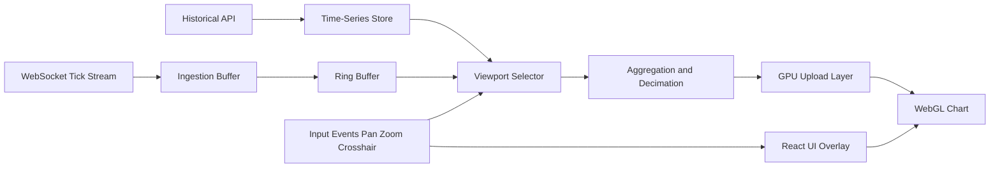

## What To Address

### Assumptions

1. Real-time price updates can burst beyond 20 updates per second during volatile periods.
2. The same chart engine must support both desktop and mobile browsers.
3. Accessibility and UI controls remain DOM-based while data plotting is GPU-based.

### Architecture Overview

The architecture separates concerns between data ingestion, time-series processing, and rendering. This reduces coupling and makes each stage independently testable and optimizable.

### What rendering technology or approach would you use, and why?

I would use a hybrid approach:

1. React for UI orchestration and controls (toolbars, panels, overlays, accessibility layers).
2. WebGL for chart rendering.

React is excellent for stateful UI and interaction workflows, while WebGL is better suited for high-frequency, high-volume plotting. This separation keeps interaction logic maintainable while ensuring rendering remains fast and predictable under load.

SVG or pure DOM rendering can work for smaller datasets, but for sustained 60fps at thousands of points and frequent updates, a GPU-backed renderer is the safer long-term choice.

### How would you handle high-frequency updates (20+ updates per second with thousands of data points)?

I would divide the system into three domains:

1. Ingestion layer
2. Time-series data layer
3. Rendering layer

#### Data layer (high-level design)

1. Load historical data first for the selected time range.
2. Stream real-time ticks over WebSocket, with SSE or polling fallback if needed.
3. Use JSON initially for debuggability, then move to binary (for example protobuf or flatbuffers) if transport becomes a bottleneck.

For scale, the backend should expose multi-resolution datasets (for example: 5Y, 1Y, 1M, 1W, 1D, intraday) so clients fetch only the resolution needed for the current zoom level.

If every second for one year is loaded at full precision, transfer size grows quickly. With one 32-bit float per second:

$$31,536,000 \times 32\text{ bits} = 1,009,152,000\text{ bits} = 126.144\text{ MB}$$

That excludes timestamps, metadata, framing, and compression overhead, so downsampling and level-of-detail are mandatory for good UX.

### Rendering

I would render the chart in WebGL using batched vertex buffers and a stable frame loop. UI, labels, and accessibility elements remain in a lightweight DOM overlay.

This gives a strong balance:

1. GPU-friendly rendering for heavy data.
2. Accessible controls in DOM.
3. Lower CPU overhead compared with continuous SVG path regeneration.

### Cross-Device Support (Desktop and Mobile)

1. Use the same rendering engine with adaptive quality tiers based on device capability.
2. Reduce point density and animation detail on low-power devices while preserving interaction quality.
3. Use touch-optimized gestures for pan and zoom on mobile with larger hit targets for overlays.
4. Keep UI overlays lightweight and responsive by separating chart rendering from interaction components.
5. Use runtime performance sampling to dynamically tune frame budget and decimation strategy per device.

### What strategies would you use to optimize rendering performance?

1. Render only when data or viewport state changes (event-driven frames, not constant reflow).
2. Use ring buffers and pre-allocated typed arrays to minimize allocations.
3. Batch updates and coalesce multiple ticks into frame-aligned commits.
4. Decimate or aggregate points based on zoom level and pixel density.
5. Keep heavy chart drawing in canvas/WebGL and keep DOM overlays minimal.
6. Use worker threads for preprocessing (downsampling, bucketing, compression).

### How would you manage memory in long-running sessions?

1. Keep only an active sliding window in memory plus a small overflow margin.
2. Persist older ranges in indexed local cache or refetch from backend on demand.
3. Use bounded buffers to prevent unbounded growth.
4. Avoid object churn by reusing buffers and structs.
5. Periodically sample memory usage and trigger compaction strategies when thresholds are exceeded.

## How would you structure data flow from WebSocket to chart rendering?

1. WebSocket message arrives and is validated.
2. Tick is appended to a pre-allocated ring buffer in timestamp order.
3. Viewport selector computes visible slice plus lookahead margin.
4. Slice is transformed into GPU-ready series buffers.
5. Buffers are uploaded to GPU and rendered in the next animation frame.
6. UI overlays (markers, trade entries, tooltips) read from indexed data references for O(1) lookup.
7. Zoom and pan events trigger dynamic resampling and viewport recomputation.

### What trade-offs would you consider between alternative approaches?

1. SVG/DOM vs WebGL:
   DOM and SVG are easier to implement and debug, but WebGL scales better for sustained high-frequency updates.
2. JSON vs binary transport:
   JSON improves readability and debugging, while binary reduces payload size and parse cost.
3. Client-side aggregation vs server-side aggregation:
   Client-side gives flexibility, server-side reduces client CPU and improves consistency.
4. Full-fidelity history vs multi-resolution history:
   Full fidelity preserves detail, multi-resolution improves speed and memory efficiency.
5. Simpler architecture vs long-term performance headroom:
   A simpler stack ships faster, but may require costly rework as throughput and data size increase.
