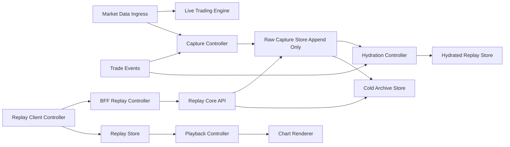
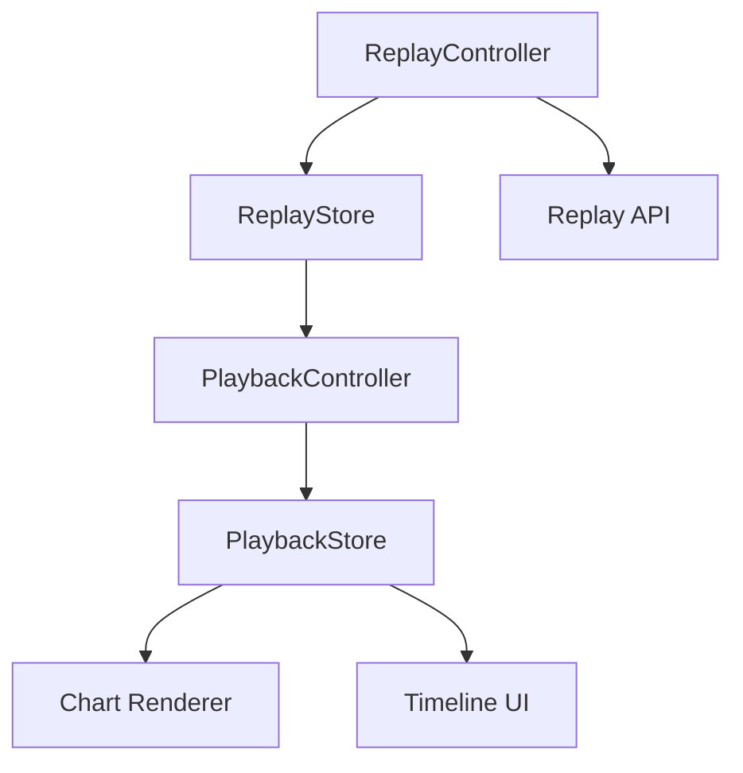

## Question 2: System Design - Trade Replay Feature

## Core Direction

Use a hydration pipeline so replay data is compacted per trade window.

1. Capture raw market ticks and trade events as immutable source-of-truth.
2. Hydrate each trade into compact archival segments (ordered, indexed, and checksumed).
3. Serve replay from cached ticker ranges in the hot path for simpler caching behavior.

### Assumptions

1. A trade has unique identifiers: trade_id, user_id, symbol, entry_time, expiry_time.
2. Market price ticks are timestamped at source and ordered per symbol with sequence numbers.
3. Live trading path is latency-sensitive and must not block on replay capture writes.
4. Replay must reproduce exactly what the user could have seen during the trade window.

### End-to-End Architecture

Why this architecture:

1. The capture path branches from ingress so replay collection does not block order execution.
2. Raw capture is append-only and immutable to protect integrity and auditability.
3. Hydration compacts replay data by trade window for archival and compliance workflows.
4. Replay serving uses cached ticker windows, which simplifies response caching and invalidation.
5. Hot and cold tiers balance low-latency queries with storage cost efficiency.
6. Client replay logic is split into controller/store components for simpler maintenance.
7. A BFF layer tailors replay responses for web and mobile clients without leaking backend complexity.

## Backend for Frontend (BFF)

Use a dedicated Replay BFF between clients and core replay services.

Why BFF here:

1. Replay UX needs client-specific payloads (timeline-focused for web, compact summaries for mobile).
2. The BFF can merge metadata + cached ticker window in one response to reduce round trips.
3. It centralizes authZ rules for end users vs internal staff replay access.
4. It protects core services from UI churn and frequent contract changes.

BFF responsibilities:

1. Endpoint composition and response shaping.
2. Cursor translation and pagination normalization.
3. Short-lived edge caching for replay metadata and first segments.
4. Replay policy checks (scope, tenancy, and audit tagging).
5. Feature-flag driven response variants for phased rollout.

## a) Data Capture Strategy

### Capture Model

1. Capture both streams:
   Trade lifecycle events: created, entered, updated, expired, settled.
2. Capture market ticks continuously with symbol, source timestamp, sequence number, bid/ask/last.
3. Hydrate replay windows by joining trade boundaries with raw tick ranges.
4. Emit compact hydrated segments keyed by trade_id and segment index.
5. For replay serving, derive trade windows from raw ticker cache keyed by symbol + time range.

### Data Format

1. On wire: compact binary schema for low overhead.
2. At rest (raw): append-only immutable events (ticks and trade events).
3. At rest (hot replay): ticker data optimized for symbol + time-range reads.
4. At rest (cold): compressed archival format for long-term retention.

### Minimal Performance Impact

1. Use async capture queue with bounded buffers.
2. Use non-blocking writes and backpressure metrics.
3. Use batch flush with durability guarantees.
4. Keep live matching/trading process isolated from replay persistence workers.
5. Run hydration asynchronously from raw capture so replay compaction never blocks live trading.

### Data Integrity and Completeness

1. Monotonic sequence numbers per symbol stream.
2. Content checksum per capture batch.
3. Idempotent ingestion keys to avoid duplicates.
4. Gap detector that alerts on missing sequence ranges.
5. Immutable storage policy for captured replay data.
6. Hydration verification step:
   hydrated segment hash + source range hash to prove replay fidelity.

## b) Data Storage and Retention

### Storage Architecture (Hot vs Cold)

1. Hot tier:
   Cached ticker data for fast replay and support tooling.
2. Cold tier:
   Raw source capture and old hydrated segments with lower storage cost.

### Data Structure

1. Partition by date and symbol.
2. Secondary index by trade_id and time range.
3. Precomputed metadata per trade:
   start/end offsets, segment_count, tick_count, min/max price, integrity markers.

### Retention Policy

1. Hot: 30 to 90 days for low-latency replay.
2. Cold: 1 to 7 years based on compliance and business policy.
3. Lifecycle jobs move data from hot to cold and validate checksums post-migration.

### Cost Optimization

1. Compression in cold tier.
2. Tiered storage classes based on access patterns.
3. Store full-fidelity ticks once, then cache ticker ranges for replay reads.
4. Deduplicate repeated metadata across contiguous hydrated segments.

## c) Data Access and Querying

### Replay API Design

Core Replay API:

1. GET /core/replays/{trade_id}/metadata
2. GET /core/replays/{trade_id}/ticks?cursor=...&limit=...
3. GET /core/replays/{trade_id}/stream

BFF Replay API:

1. GET /bff/replays/{trade_id}/bootstrap
   Returns metadata + first ticker chunk + permissions in one call.
2. GET /bff/replays/{trade_id}/ticks?cursor=...&limit=...
   Returns client-shaped ticker chunks and UI-ready annotations.
3. GET /bff/replays/{trade_id}/timeline
   Returns compact timeline markers for scrubber and key events.

### Efficient Large-Range Retrieval

1. Cursor-based pagination.
2. Ticker chunking by time window.
3. Server-side filtering by symbol and exact trade window.

### Caching Strategy

1. Metadata cache by trade_id.
2. Short-lived chunk cache for popular support investigations.
3. CDN edge caching for static replay manifests if applicable.
4. BFF bootstrap cache to accelerate time-to-first-frame.
5. Symbol + time-range cache as the primary replay read path.

### Query Performance

1. Use covering indexes for trade_id plus timestamp.
2. Keep hot shards small enough for predictable latency.
3. Prewarm cache for frequently replayed recent trades.
4. Use BFF-level request coalescing to avoid duplicate fan-out during incident investigations.

## d) Replay Implementation

### Client and Server Components (Controller/Store Pattern)

1. ReplayController:
   Loads metadata, orchestrates ticker chunk fetch, handles errors/retries.
2. ReplayStore:
   Holds immutable ticker chunks and integrity state.
3. PlaybackController:
   Manages play, pause, seek, and speed.
4. PlaybackStore:
   Holds playback cursor, speed, and UI state.
5. ChartRenderer:
   Renders current frame from PlaybackStore snapshot.

### Playback Controls

1. Play/pause updates only playback state, not fetched replay data.
2. Speed changes adjust virtual clock multiplier (0.5x, 1x, 2x, 4x).
3. Seek operation jumps to nearest indexed chunk then resumes streaming.

### Efficient Rendering

1. Pre-buffer upcoming chunks.
2. Frame-step based on timestamp delta, not only tick count.
3. Replay from cached ticker chunks; never mutate persisted source data.

### User Experience Flow

1. User opens historical trade.
2. Metadata loads instantly.
3. Replay buffers first segment and enables controls.
4. User plays, pauses, seeks, and changes speed with immediate UI response.
5. Integrity badge indicates capture status and completeness.

## e) Trade-Offs and Scalability

### Key Trade-Offs

1. Cached ticker replay vs hydrated replay responses:
   cached ticker responses are simpler to reason about and cache; hydrated responses can be smaller but add response-model complexity.
2. Hot retention length vs latency/cost:
   Longer hot retention improves speed but raises operating cost.
3. Simpler capture pipeline vs hydration pipeline:
   hydration adds complexity but makes replay delivery significantly more efficient.
4. Simpler integrity controls vs stronger integrity controls:
   More controls add complexity but reduce replay disputes and compliance risk.
5. Monolith replay service vs split services:
   Monolith is easier initially, split services scale better under high read volume.
6. Direct client-to-core API vs BFF:
   direct access is simpler at first; BFF adds an extra hop but improves contract stability, caching, and client-tailored performance.

### Maintainability vs Scalability

1. Maintainability-first:
   Keep controller/store boundaries clear and business rules centralized.
2. Scalability-first:
   Scale ingest workers, query API replicas, and storage tiers independently.
3. Balanced approach:
   Start with one replay service and clear internal modules, then extract heavy modules when SLOs are at risk.

## Design Patterns Used

1. Controller/Store for client replay orchestration and predictable UI state.
2. CQRS-style separation between write-heavy capture and read-heavy replay queries.
3. Event sourcing principles for immutable, auditable capture logs.
4. Strategy pattern for playback speed and seek policies.
5. Hydration pipeline pattern:
   transform raw events into compact archival read models for compliance and cost control.
6. Backend for Frontend pattern:
   isolate UI-specific orchestration from core domain services.

## References and Examples

1. Event-driven architecture patterns for low-latency capture pipelines.
2. Append-only log and immutable event storage patterns for auditability.
3. Time-series indexing and partitioning approaches for large range queries.
4. Controller/store state management practices for deterministic replay UX.
