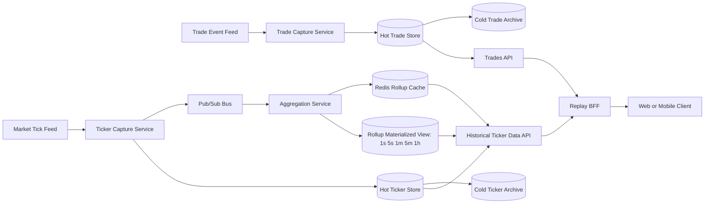
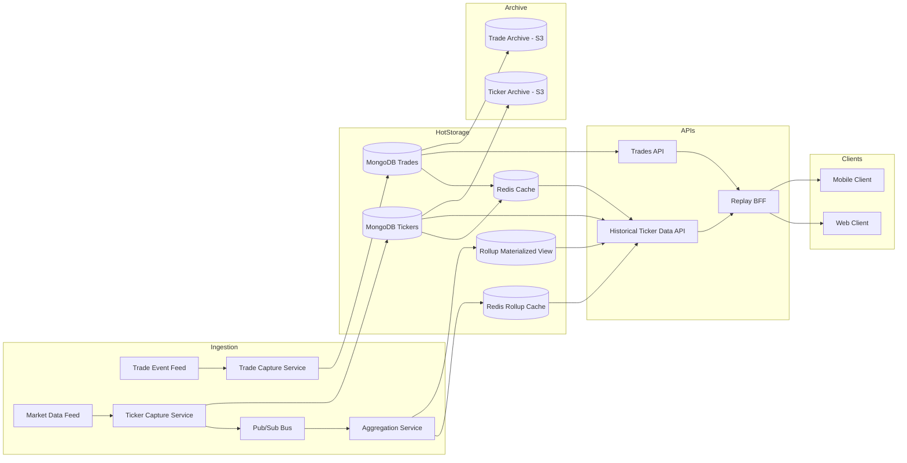

## Question 2: Trade Replay Feature

### Scope and Priorities

This proposal is intentionally simple and aligned with the two required priorities:

1. Minimal performance impact on live trading.
2. Exact replay integrity (no missing, reordered, or synthetic ticks).

Guiding decisions:

1. Keep ticker data and trade data as separate data domains.
2. Use async append-only capture so replay work never blocks live execution.
3. Build replay from trade boundaries plus historical ticker windows.
4. Use a thin BFF for response composition and policy enforcement.

## a) Data Capture Strategy

### What to capture

1. Ticker stream:
   symbol, source_timestamp, sequence, bid, ask, last.
2. Trade stream:
   trade_id, user_id, symbol, entry_time, expiry_time, lifecycle events.

### Capture flow

1. Ticker Capture Service writes append-only ticker events.
2. Trade Capture Service writes append-only trade events.
3. Capture is async via queues/pub-sub.
4. Replay logic runs outside live trading services.

### Integrity controls

1. Sequence monotonicity checks per symbol.
2. Idempotent event keys to prevent duplicates.
3. Batch checksums on ingestion.
4. Gap detection with alerting.

Why this works:

1. Live-path latency remains isolated.
2. Auditability is strong because source events are immutable.
3. Ticker and trade pipelines can scale independently.

## b) Data Storage and Retention

### Storage model

1. Ticker hot path:
   Redis cache plus persistent ticker store.
2. Trade hot path:
   consistency-first append-only trade store.
3. Cold storage:
   separate ticker archive and trade archive.

### Data layout

1. Ticker partition key: symbol + date bucket.
2. Ticker index: symbol + timestamp.
3. Trade index: trade_id, plus account/time lookup fields.

### Retention policy (example)

1. Hot retention: 30 to 90 days.
2. Cold retention: 1 to 7 years based on policy/compliance.
3. Tiering jobs migrate hot to cold with checksum verification.

### Cost controls

1. Short TTL on cache entries.
2. Cold storage compression.
3. Cache only hot replay windows.

## c) Data Access and Querying

### API model

1. Trades API:
   GET /trades/{trade_id}
   GET /trades/{trade_id}/events
2. Historical Ticker Data API:
   GET /historical-tickers?symbol=...&from=...&to=...&cursor=...&limit=...&resolution=...
3. Replay BFF API:
   GET /bff/replays/{trade_id}/bootstrap
   GET /bff/replays/{trade_id}/ticks?cursor=...&limit=...

### Data-layer transport

1. Capture side:
   pub/sub from ticker capture to downstream aggregation and persistence workers.
2. Query side:
   HTTP for paginated reads, optional stream endpoint for continuous playback.
3. Payload format:
   JSON-first for operability, with binary option for high-volume windows.
4. Delivery optimization:
   compression and cache-control on replay responses.

### Zoomed-out versions (multi-resolution)

For large windows, do not return raw ticks by default.

1. Raw ticks remain source of truth.
2. Aggregation Service builds rollups (1s, 5s, 1m, 5m, 1h).
3. Redis stores rollups keyed by symbol + resolution + time bucket.
4. API selects resolution based on requested window and viewport.
5. Zoom-in progressively switches to finer data and finally raw ticks.

Why this is necessary:

1. Avoids sending excessive point counts.
2. Improves latency and rendering stability.
3. Reduces repeated aggregation and backend read cost.

### Query flow

1. BFF gets trade metadata from Trades API.
2. BFF derives replay window from entry and expiry.
3. BFF requests ticker chunks from Historical Ticker Data API.
4. Historical Ticker Data API serves rollups from Redis when possible, raw store otherwise.
5. BFF returns a client-shaped response.

### Query performance strategy

1. Cursor pagination for all large windows.
2. Time-bucket chunking for stable payload size.
3. Metadata cache by trade_id.
4. Ticker cache by symbol + resolution + bucket.

## d) Replay Implementation

### Client design (controller/store pattern)

1. ReplayController:
   initializes replay and coordinates fetch operations.
2. ReplayStore:
   stores immutable ticker chunks and metadata.
3. PlaybackController:
   handles play, pause, seek, speed.
4. PlaybackStore:
   tracks cursor, speed, and player state.

### Playback behavior

1. Load bootstrap metadata plus first chunk.
2. Start playback immediately.
3. Prefetch upcoming chunks in background.
4. Seek to nearest chunk boundary, then continue.

### Rendering guidance

1. Advance frames by timestamp.
2. Keep replay data immutable.
3. Use pre-buffering to avoid visual stutter.

## e) End-to-End Architecture

## Overall Infrastructure Diagram

### Component responsibilities

1. Ticker Capture Service:
   validates and persists ticker events.
2. Trade Capture Service:
   persists trade lifecycle events and replay boundaries.
3. Aggregation Service:
   consumes ticker pub/sub, builds rollups, writes rollup windows to Redis.
4. Historical Ticker Data API:
   serves ticker windows, preferring Redis rollups for zoomed-out requests.
5. Trades API:
   serves trade metadata and lifecycle history.
6. Replay BFF:
   composes responses, applies policy, and shapes payloads for clients.

### Trade-offs

1. Simplicity vs compression:
   this model favors simpler serving logic and operational clarity.
2. Direct API calls vs BFF:
   BFF adds one hop but centralizes policy and reduces client complexity.
3. Separate stores vs unified store:
   separation reduces coupling and enables independent scaling paths.
