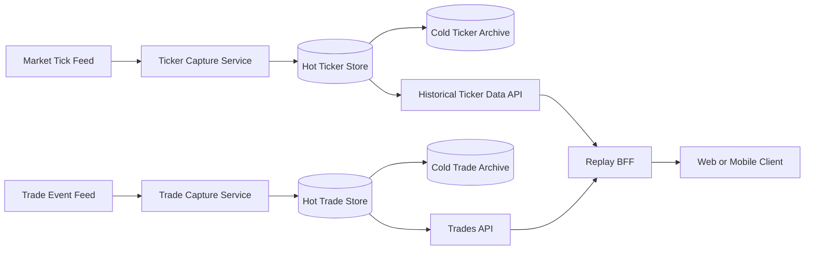
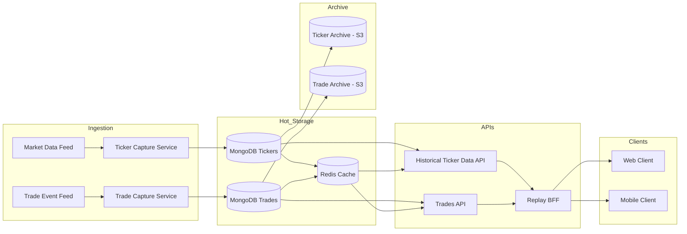

## Question 2: Trade Replay Feature

### Scope and Priorities

This design is optimized for the two required priorities:

1. Minimal impact on live trading performance.
2. Exact replay integrity (no missing, reordered, or synthetic ticks).

Core decisions:

1. Keep ticker data and trade data in separate pipelines.
2. Use asynchronous append-only capture so live flows never block on replay writes.
3. Build replay from trade boundaries plus historical ticker windows.
4. Use a BFF layer only for response composition, policy checks, and client shaping.

## a) Data Capture Strategy

### What to capture

1. Ticker stream:
   symbol, source_timestamp, sequence, bid, ask, last.
2. Trade stream:
   trade_id, user_id, symbol, entry_time, expiry_time, lifecycle events.

### How capture works

1. Ticker Capture Service writes append-only ticker events.
2. Trade Capture Service writes append-only trade events.
3. Both writes are async via bounded queues.
4. Replay processing does not run in the live trading path.

### Integrity controls

1. Monotonic sequence checks per symbol.
2. Idempotent event keys to prevent duplicates.
3. Batch checksums on ingest.
4. Gap detection jobs with alerting.

Why this works:

1. Live path latency stays stable.
2. Data is auditable and reconstructable.
3. Ticker and trade systems scale independently.

## b) Data Storage and Retention

### Storage model

1. Ticker hot path:
   Redis cache (short TTL) plus persistent ticker store.
2. Ticker persistence:
   high write/read datastore with partitioning by symbol and time.
3. Trade store:
   append-only, consistency-first store indexed by trade_id.
4. Cold archives:
   separate archival tiers for tickers and trades.

### Data layout

1. Ticker partition key: symbol + date bucket.
2. Ticker index: symbol + timestamp.
3. Trade index: trade_id, plus lookup fields for account and time.

### Retention policy (example)

1. Hot retention: 30 to 90 days.
2. Cold retention: 1 to 7 years (policy/compliance dependent).
3. Tiering jobs move data to archive with checksum verification.

### Cost controls

1. TTL-based cache eviction.
2. Compression in cold storage.
3. Cache only frequently replayed windows.

## c) Data Access and Querying

### API model

1. Trades API:
   GET /trades/{trade_id}
   GET /trades/{trade_id}/events
2. Historical Ticker Data API:
   GET /historical-tickers?symbol=...&from=...&to=...&cursor=...&limit=...
3. Replay BFF API:
   GET /bff/replays/{trade_id}/bootstrap
   GET /bff/replays/{trade_id}/ticks?cursor=...&limit=...

### Query flow

1. BFF loads trade metadata and lifecycle from Trades API.
2. BFF derives replay bounds from entry_time and expiry_time.
3. BFF fetches ticker chunks from Historical Ticker Data API.
4. BFF returns a client-optimized replay payload.

### Query performance strategy

1. Cursor pagination for large windows.
2. Time-bucket chunking for stable payload size.
3. Metadata cache keyed by trade_id.
4. Ticker cache keyed by symbol + time bucket.

## d) Replay Implementation

### Client design (controller/store pattern)

1. ReplayController:
   initializes replay and orchestrates chunk fetches.
2. ReplayStore:
   holds immutable ticker chunks and trade metadata.
3. PlaybackController:
   play, pause, seek, and speed controls.
4. PlaybackStore:
   current cursor, speed, and UI state.

### Playback behavior

1. Load bootstrap data (metadata + first chunk).
2. Start playback immediately.
3. Prefetch subsequent chunks in background.
4. On seek, jump to nearest chunk boundary and continue.

### Rendering guidance

1. Progress frame by timestamp.
2. Keep replay data immutable.
3. Use pre-buffering to prevent stutter.

## e) End-to-End Architecture

## Overall Infrastructure Diagram

### Component responsibilities

1. Ticker Capture Service:
   validates and stores ticker events.
2. Trade Capture Service:
   stores lifecycle events and replay boundaries.
3. Historical Ticker Data API:
   serves ticker chunks by symbol and time range.
4. Trades API:
   serves trade metadata and lifecycle history.
5. Replay BFF:
   composes responses, enforces policy, and shapes payloads.

### Trade-offs

1. Simplicity vs compression:
   simpler replay serving avoids complex derived-response pipelines.
2. Direct client calls vs BFF:
   BFF adds one hop but simplifies clients and centralizes authorization.
3. Separate stores vs unified store:
   separation lowers coupling and improves independent scaling.
