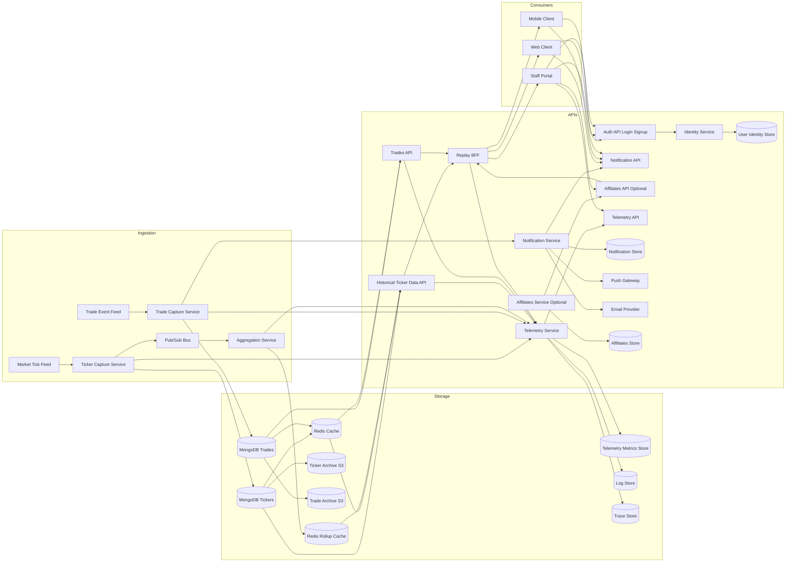
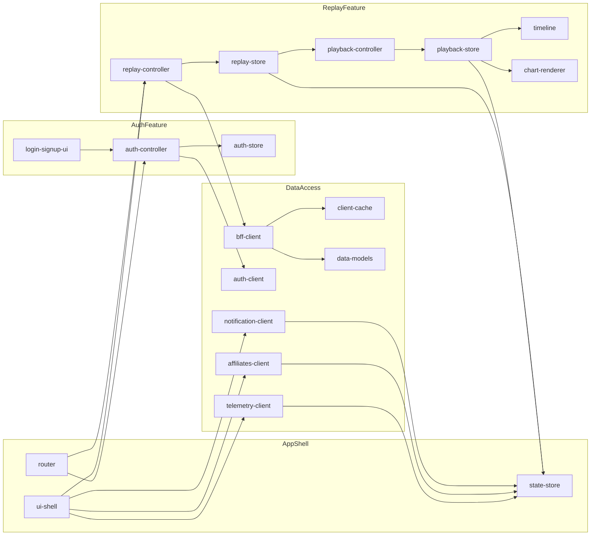
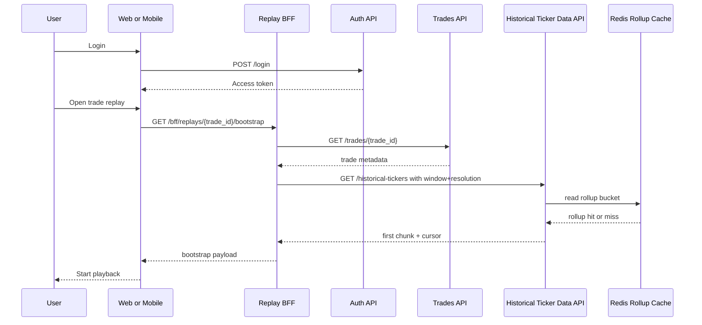
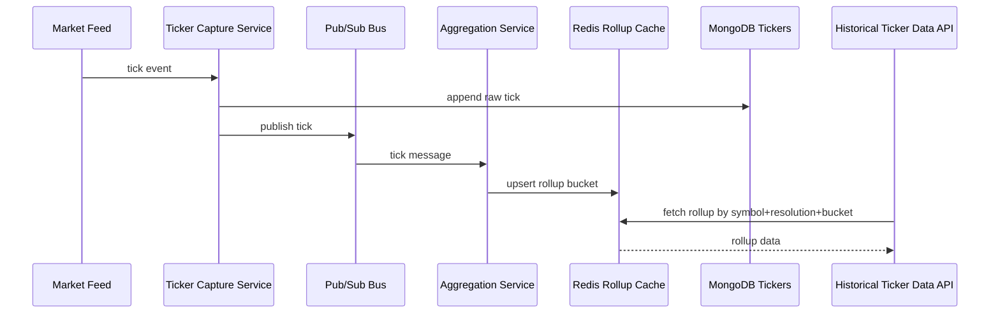

# Consolidated Service Interactions

## Backend Micro-Services Interactions



## Frontend Package Interaction Graph



## Replay Reference Pack

### Example Schemas and Payloads

#### ticker_event (source of truth)

```json
{
  "event_id": "tick_BTCUSD_2026-05-29T10:15:30.123Z_9987123",
  "symbol": "BTCUSD",
  "source_timestamp": "2026-05-29T10:15:30.123Z",
  "sequence": 9987123,
  "bid": 68420.12,
  "ask": 68420.43,
  "last": 68420.3
}
```

#### trade_event

```json
{
  "event_id": "trade_evt_7f2a_entered",
  "trade_id": "trd_7f2a",
  "user_id": "usr_214",
  "symbol": "BTCUSD",
  "entry_time": "2026-05-29T10:15:25.000Z",
  "expiry_time": "2026-05-29T10:16:25.000Z",
  "status": "entered",
  "created_at": "2026-05-29T10:15:25.012Z"
}
```

#### rollup_candle

```json
{
  "symbol": "BTCUSD",
  "resolution": "1m",
  "bucket_start": "2026-05-29T10:15:00.000Z",
  "open": 68410.0,
  "high": 68450.2,
  "low": 68398.1,
  "close": 68420.3,
  "volume": 125.44,
  "tick_count": 1200
}
```

#### replay_bootstrap_response

```json
{
  "trade": {
    "trade_id": "trd_7f2a",
    "symbol": "BTCUSD",
    "entry_time": "2026-05-29T10:15:25.000Z",
    "expiry_time": "2026-05-29T10:16:25.000Z",
    "status": "expired"
  },
  "access_scope": "end_user",
  "resolution": "1s",
  "cursor": "cur_01",
  "ticks": [
    {
      "t": "2026-05-29T10:15:25.000Z",
      "last": 68411.4
    },
    {
      "t": "2026-05-29T10:15:26.000Z",
      "last": 68412.05
    }
  ]
}
```

### Sequence Diagrams

#### Sequence A: Login to Replay Playback



#### Sequence B: Tick Ingest to Rollup Query



### Failure Modes and Fallbacks

1. Pub/Sub lag spikes:
   fallback to raw ticker reads for affected windows and alert on consumer lag threshold.
2. Redis rollup cache miss:
   query raw ticker store, compute on-demand aggregate, then backfill Redis asynchronously.
